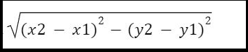

# DISTANCE-BETWEEN-TWO-POINTS

## AIM:
To write a python program to find the distance two 2 points
## ALGORITHM:
### Step 1: 
Write a program to find distance
### Step 2: 
Get the input
### Step 3: 
Substitute the values in the distance formula 
### Step 4: 
Execute the program
### Step 5: 
Get the result
### PROGRAM:
```
#Program to find the distance between two points.
#Developed by: yuva krishna k
#RegisterNumber: 212222110056
import math
l1=[4,2]
l2=[10,6]
dist=math.sqrt(((l2[0]-l1[0])**2)+(l2[1]-l1[1])**2)
print("{:.2f}".format(dist))

```

### OUTPUT:
 


### RESULT:
